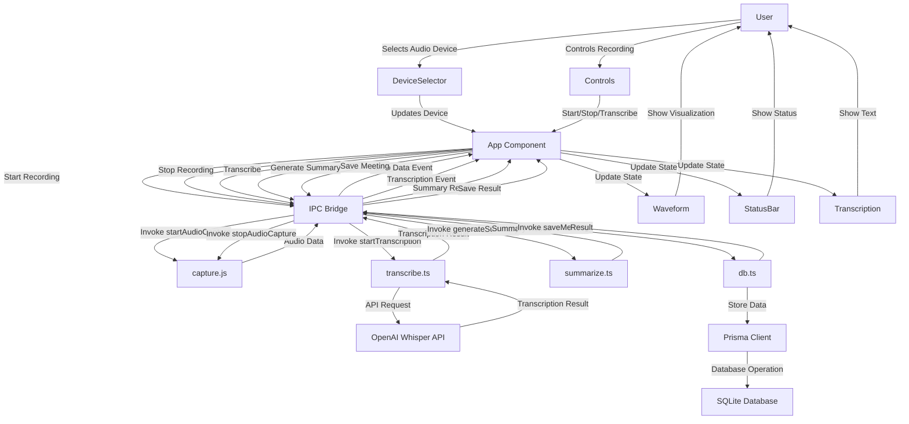

# Meeting Assistant Codebase Summary

## Directory Structure (Updated with TypeScript Migration)

```
meeting_assistant/
├── cline_docs/            # Project documentation
├── dist/                  # Webpack output directory
├── node_modules/          # npm dependencies
├── poc/                   # Proof of Concept implementation
│   ├── recordings/        # Directory for saved audio recordings
│   ├── temp/              # Temporary files directory
│   ├── prisma/            # Prisma database schema and migrations
│   │   └── schema.prisma  # Database schema definition
│   ├── src/               # Source code
│   │   ├── main.ts        # Electron main process (TypeScript)
│   │   ├── preload.ts     # Electron preload script for IPC (TypeScript)
│   │   ├── capture.ts     # Audio capture functionality (TypeScript)
│   │   ├── transcribe.ts  # Transcription functionality (TypeScript)
│   │   ├── summarize.ts   # Summary generation (TypeScript)
│   │   ├── email.ts       # Email functionality (TypeScript)
│   │   ├── db.ts          # Database operations (TypeScript)
│   │   ├── generated/     # Prisma-generated types and clients
│   │   └── renderer/      # React frontend
│   │       ├── index.js   # React entry point
│   │       ├── index.html # HTML template
│   │       ├── App.jsx    # Main React component
│   │       ├── styles.css # Global styles
│   │       └── components/ # UI components
│   │           ├── Controls.jsx        # Recording control buttons
│   │           ├── DeviceSelector.jsx  # Audio device dropdown
│   │           ├── StatusBar.jsx       # Status messages
│   │           └── Transcription.jsx   # Transcription display
│   ├── package.json       # npm package configuration
│   ├── webpack.config.js  # Webpack configuration
│   ├── .env               # Environment variables
│   └── .env.example       # Example environment variables
└── research/              # Research documentation
    └── audio-capture-transcription-research.md
```

## Architecture Overview

The Meeting Assistant follows an Electron architecture with React for the UI and a Prisma database backend:

1. **Electron Main Process** (`main.ts`):
   - Entry point for the application
   - Creates and manages the application window
   - Sets up IPC handlers for audio capture, transcription, and database operations
   - Initializes the database connection

2. **Preload Script** (`preload.ts`):
   - Securely exposes IPC communication channels to the renderer
   - Provides a bridge between main process capabilities and renderer UI

3. **Audio Capture Module** (`capture.ts`):
   - Handles audio recording from selected devices
   - Manages recording state and audio buffers
   - Saves recordings to disk

4. **Transcription Module** (`transcribe.ts`):
   - Interfaces with OpenAI Whisper API
   - Processes audio data for transcription
   - Returns text transcription results

5. **Database Module** (`db.ts`):
   - Manages database connections using Prisma
   - Provides methods for CRUD operations on meetings
   - Handles data migrations and schema updates
   - Ensures data integrity and relationships

6. **Summary Module** (`summarize.ts`):
   - Generates meeting summaries using OpenAI's GPT model
   - Structures summary data with key points, action items, and decisions
   - Saves summaries to the database

7. **Email Module** (`email.ts`):
   - Provides functionality to send meeting summaries via email
   - Manages email templates and formatting
   - Handles SMTP configuration

8. **React UI** (`renderer/`):
   - Main App component manages application state
   - Specialized components for various UI elements
   - Communicates with main process via IPC bridge

## Data Flow (Updated with Database Integration)



## Component Relationships

1. **App Component**:
   - Central state manager for the application
   - Coordinates between UI components and IPC bridge
   - Maintains recording state, transcription results, and audio data
   - Handles database operations for saving and loading meetings

2. **UI Components**:
   - **DeviceSelector**: Lists available audio devices, updates App state on change
   - **Controls**: Provides buttons for recording and transcription, triggers App methods
   - **StatusBar**: Displays current application status from App state
   - **Transcription**: Renders transcription results from App state

3. **Main Process Modules**:
   - **capture.ts**: Handles audio recording, sends data back via events
   - **transcribe.ts**: Processes audio for transcription, sends results via events
   - **summarize.ts**: Generates meeting summaries from transcriptions
   - **db.ts**: Handles database operations for persistent storage
   - **email.ts**: Manages email functionality for sharing summaries

## State Management

The application uses React's useState hooks for state management, with database persistence:

- **isRecording**: Tracks if recording is in progress
- **audioDevices**: List of available audio input devices
- **selectedDevice**: Currently selected audio device
- **status**: Current application status message
- **transcription**: Transcription result text
- **error**: Error message if any
- **audioChunks**: Collected audio data buffers
- **canTranscribe**: Flag indicating if transcription is available

## IPC Communication

Communication between Electron's main and renderer processes happens via IPC:

1. **From Renderer to Main**:
   - `window.api.startAudioCapture()`: Begin recording from selected device
   - `window.api.stopAudioCapture()`: Stop active recording
   - `window.api.startTranscription()`: Request transcription of recorded audio
   - `window.api.generateSummary()`: Generate meeting summary from transcription
   - `window.api.saveMeeting()`: Save meeting data to database
   - `window.api.listMeetings()`: Retrieve list of saved meetings
   - `window.api.loadMeeting()`: Load a specific meeting by ID
   - `window.api.sendEmail()`: Send a meeting summary via email

2. **From Main to Renderer**:
   - `audio-data`: Event with chunks of recorded audio
   - `transcription-result`: Event with transcription text
   - `error`: Event with error information

## Technology Stack Updates

1. **TypeScript Migration**:
   - The codebase has been converted to TypeScript
   - ESM modules are used for better import/export handling
   - Types defined for API responses, data models, and state

2. **Database Integration**:
   - Prisma ORM for database operations
   - SQLite for local storage (can be scaled to PostgreSQL, MySQL)
   - Typed data models with relationships
   - Migration capability for schema changes

## Challenges and Considerations

1. **Audio Format Handling**:
   - Current implementation uses raw PCM, with WAV conversion improvements
   - Buffer handling optimized for cross-process communication

2. **React Integration**:
   - Using useEffect for event listeners and cleanup
   - Proper state updates on asynchronous events
   - TypeScript interfaces for component props

3. **Performance**:
   - Audio visualization can be resource-intensive
   - Large audio files may cause memory pressure
   - Database queries optimized for quick retrieval

4. **Modularity and Architecture**:
   - Improved separation of concerns with TypeScript modules
   - Database layer abstraction for testing and future changes
   - Context API consideration for deeper component trees

## Version Control Considerations

The project's `.gitignore` configuration excludes the following categories of files:

1. **Dependencies and Package Managers**:
   - `node_modules/` directory
   - `package-lock.json` (~337KB) - regenerated on npm install

2. **Build and Distribution Artifacts**:
   - `dist/`, `build/`, and `out/` directories
   - Webpack output (`.webpack/`)
   - Electron builder output
   - Application installers and bundles (`.app`, `.exe`, `.dmg`, etc.)

3. **Environment and Configuration**:
   - `.env` files containing secrets and API keys
   - Local configuration files

4. **Generated Content**:
   - `recordings/` directory - audio recordings (potentially large files)
   - `transcripts/` - text transcriptions
   - `summaries/` - meeting summaries
   - All audio files (`.wav`, `.mp3`, `.ogg`, `.raw`)

5. **Temporary and Cache Files**:
   - Editor-specific files (`.vscode/`, `.idea/`)
   - OS-generated files (`.DS_Store`)
   - Temporary directories (`temp/`, `tmp/`)
   - Electron cache directories

This configuration ensures that only essential source code is versioned, while build artifacts, local configurations, and large generated files are excluded to keep the repository size manageable.
