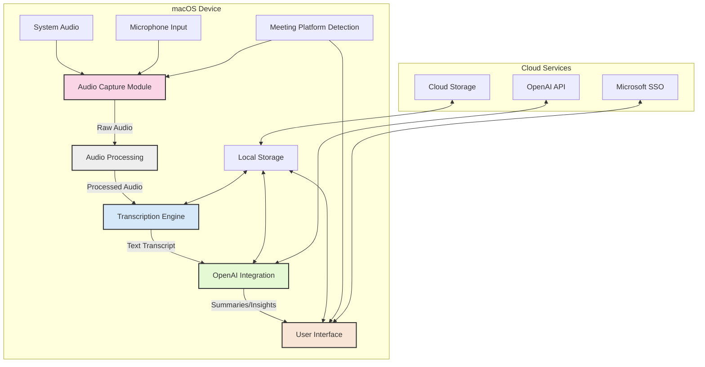
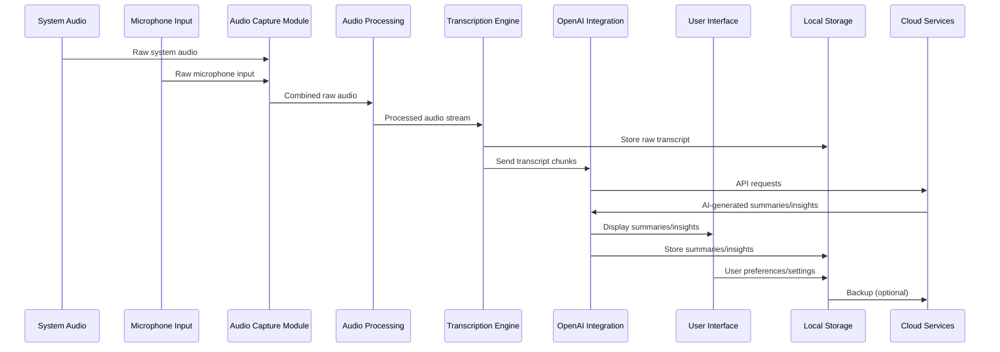
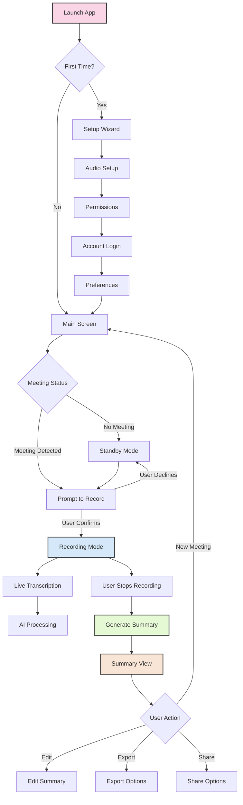

# Meeting Assistant Application: System Architecture and UI Design

## Table of Contents
- [System Architecture](#system-architecture)
  - [Component Diagram](#component-diagram)
  - [Data Flow](#data-flow)
  - [Technical Stack Recommendations](#technical-stack-recommendations)
  - [Standalone App vs. Browser Extension](#standalone-app-vs-browser-extension)
  - [Security Considerations](#security-considerations)
- [User Interface Design](#user-interface-design)
  - [Wireframes](#wireframes)
  - [User Flow](#user-flow)
  - [Key Features and Controls](#key-features-and-controls)
  - [Accessibility Considerations](#accessibility-considerations)
- [Implementation Plan](#implementation-plan)
  - [Development Phases and Milestones](#development-phases-and-milestones)
  - [Testing Strategy](#testing-strategy)
  - [Deployment Considerations](#deployment-considerations)

## System Architecture

### Component Diagram

The following component diagram illustrates the major parts of the Meeting Assistant application and their relationships:



### Data Flow

The data flows through the system as follows:



### Technical Stack Recommendations

#### Audio Capture and Processing
- **BlackHole**: Virtual audio device for system audio capture
- **Core Audio Framework**: For direct access to audio streams
- **AudioKit**: For audio processing and manipulation
- **FFmpeg**: For audio format conversion if needed

#### Transcription Engine
- **Whisper AI**: Local transcription for privacy and reduced latency
- **Vosk**: Alternative offline speech recognition
- **WebSpeech API**: For browser extension option

#### Backend/Core
- **Electron**: For cross-platform desktop application
- **Node.js**: For backend processing
- **Express**: For API endpoints if needed
- **SQLite**: For local storage of transcripts and settings

#### Frontend
- **React**: For building the user interface
- **Tailwind CSS**: For styling
- **Electron Store**: For persistent settings

#### Cloud Integration
- **OpenAI API**: For summarization and insights
- **Azure AD Authentication Library**: For Microsoft SSO integration
- **Intune SDK**: For corporate security compliance

#### Mobile Integration (Future)
- **React Native**: For iOS companion app
- **WebSockets**: For real-time communication between desktop and mobile

### Standalone App vs. Browser Extension

#### Standalone App (Electron)

**Pros:**
- Full system-level access to audio devices
- Better performance for audio processing and transcription
- Works across all meeting platforms without platform-specific code
- More robust offline capabilities
- Better security control for corporate environments
- Can implement deeper OS integration

**Cons:**
- Larger installation footprint
- Requires separate installation and updates
- More complex deployment in corporate environments
- Higher development complexity

#### Browser Extension

**Pros:**
- Easier distribution through browser stores
- Simpler updates
- Lighter resource footprint
- More familiar installation process for users
- Potentially easier approval in some corporate environments

**Cons:**
- Limited access to system audio (browser tab audio only)
- Platform-specific implementations needed for each meeting service
- Limited offline capabilities
- Less control over security aspects
- Dependent on browser permissions and API changes

#### Recommendation

Based on the requirements for system audio capture across multiple meeting platforms and the need for corporate security compliance, the **standalone Electron app** is recommended as the primary approach. This provides the necessary system-level access for audio capture and offers better security controls for corporate environments.

A phased approach could include:
1. Develop the core standalone app first
2. Consider a browser extension as a complementary lightweight option later
3. Develop the iOS companion app as a final phase

### Security Considerations

1. **Data Privacy**
   - All audio processing and transcription should happen locally when possible
   - Transcripts should be encrypted at rest
   - Clear data retention policies with options for automatic deletion

2. **Corporate Compliance**
   - Microsoft Intune integration for device management
   - Support for Microsoft SSO authentication
   - Compliance with corporate data loss prevention (DLP) policies
   - Audit logging for security monitoring

3. **API Security**
   - Secure storage of API keys
   - Rate limiting for API calls
   - Minimal data transmission to external services

4. **Application Security**
   - Code signing for application distribution
   - Regular security updates
   - Sandboxed execution environment
   - Permission-based access to system resources

5. **User Control**
   - Clear recording indicators
   - Easy meeting pause/resume controls
   - Ability to redact sensitive information before sharing
   - Granular permission settings

## User Interface Design

### Wireframes

#### Main Application Window

```
+-------------------------------------------------------+
|  Meeting Assistant                          [_][□][X] |
+-------------------------------------------------------+
| [Record] [Pause] [Stop]        Meeting: [Detecting▼]  |
+-------------------------------------------------------+
|                                                       |
|  LIVE TRANSCRIPT                                      |
|  -----------------------------------------------      |
|  [13:05] John: I think we should focus on the Q3      |
|  targets before moving to the new project.            |
|                                                       |
|  [13:06] Sarah: Agreed. The timeline seems tight      |
|  but I believe we can make it work if we              |
|  prioritize correctly.                                |
|                                                       |
|  [13:07] Michael: What about the resource             |
|  allocation? Do we have enough bandwidth?             |
|  -----------------------------------------------      |
|                                                       |
+-------------------------------------------------------+
|                                                       |
|  AI INSIGHTS                                          |
|  -----------------------------------------------      |
|  • Meeting focused on Q3 targets prioritization       |
|  • Concerns about timeline and resource allocation    |
|  • Action items:                                      |
|    - Review resource bandwidth (Owner: Michael)       |
|    - Finalize Q3 priorities (Owner: Team)             |
|  -----------------------------------------------      |
|                                                       |
+-------------------------------------------------------+
|  [Settings] [Export] [Share]        [Minimize to Tray]|
+-------------------------------------------------------+
```

#### Settings Panel

```
+-------------------------------------------------------+
|  Settings                                   [_][□][X] |
+-------------------------------------------------------+
|                                                       |
|  +-------------------+  +------------------------+    |
|  |                   |  |                        |    |
|  |    Categories     |  |  Audio Settings        |    |
|  |                   |  |                        |    |
|  | > Audio           |  |  System Audio Source:  |    |
|  | > Transcription   |  |  [BlackHole 2ch      ▼]    |
|  | > AI Integration  |  |                        |    |
|  | > Storage         |  |  Microphone Source:    |    |
|  | > Appearance      |  |  [Built-in Microphone ▼]    |
|  | > Security        |  |                        |    |
|  | > Advanced        |  |  Audio Quality:        |    |
|  |                   |  |  [High (16-bit/48kHz) ▼]    |
|  |                   |  |                        |    |
|  |                   |  |  [ ] Noise Reduction   |    |
|  |                   |  |  [ ] Echo Cancellation |    |
|  |                   |  |                        |    |
|  |                   |  |  Test Audio Capture:   |    |
|  |                   |  |  [Test] [Stop]         |    |
|  |                   |  |                        |    |
|  +-------------------+  +------------------------+    |
|                                                       |
|                     [Cancel]    [Save]                |
+-------------------------------------------------------+
```

#### Meeting Summary View

```
+-------------------------------------------------------+
|  Meeting Summary                            [_][□][X] |
+-------------------------------------------------------+
|  Meeting: Weekly Project Sync                         |
|  Date: April 22, 2025                                 |
|  Duration: 45 minutes                                 |
|  Participants: John, Sarah, Michael, Elena            |
+-------------------------------------------------------+
|                                                       |
|  EXECUTIVE SUMMARY                                    |
|  -----------------------------------------------      |
|  The team discussed Q3 targets and resource           |
|  allocation for the new project. Concerns were        |
|  raised about timeline feasibility, but the team      |
|  agreed to prioritize tasks to meet deadlines.        |
|  -----------------------------------------------      |
|                                                       |
|  KEY POINTS                                           |
|  • Q3 targets need to be finalized by Friday          |
|  • Resource constraints identified in design team     |
|  • New project kickoff scheduled for May 10           |
|  • Budget approval pending from finance               |
|                                                       |
|  ACTION ITEMS                                         |
|  [✓] Review resource allocation (Michael, Apr 24)     |
|  [ ] Finalize Q3 priorities (Team, Apr 26)            |
|  [ ] Schedule budget review (Sarah, Apr 23)           |
|  [ ] Prepare design brief (Elena, Apr 30)             |
|                                                       |
+-------------------------------------------------------+
|  [Full Transcript] [Export to PDF] [Share via Email]  |
+-------------------------------------------------------+
```

### User Flow



### Key Features and Controls

1. **Recording Controls**
   - One-click recording start/stop
   - Pause/resume functionality
   - Visual recording indicator
   - Automatic meeting detection (optional)

2. **Transcription Display**
   - Real-time scrolling transcript
   - Speaker identification (when possible)
   - Timestamp markers
   - Search functionality
   - Text highlighting

3. **AI Insights Panel**
   - Live key points extraction
   - Action item identification
   - Decision tracking
   - Topic categorization
   - Sentiment analysis (optional)

4. **Meeting Management**
   - Meeting naming and categorization
   - Calendar integration
   - Meeting history and search
   - Favorites/pinning important meetings

5. **Export and Sharing**
   - Multiple export formats (PDF, DOCX, TXT, HTML)
   - Direct sharing to email, Slack, Teams
   - Selective sharing (full transcript vs. summary only)
   - Access control options

6. **Settings and Configuration**
   - Audio source selection and testing
   - Transcription language and accuracy settings
   - AI customization (summary length, focus areas)
   - Storage and retention policies
   - Appearance customization

### Accessibility Considerations

1. **Visual Accessibility**
   - High contrast mode
   - Adjustable text size
   - Screen reader compatibility
   - Keyboard navigation support
   - Color blindness considerations in UI design

2. **Hearing Accessibility**
   - Visual indicators for audio events
   - Transcript as alternative to audio
   - Closed captioning export options

3. **Motor Accessibility**
   - Keyboard shortcuts for all major functions
   - Voice command support (optional)
   - Reduced motion option for animations

4. **Cognitive Accessibility**
   - Clear, consistent interface
   - Simplified mode option
   - Progressive disclosure of complex features
   - Helpful tooltips and contextual help

5. **Language Accessibility**
   - Multi-language support for UI
   - Translation options for transcripts
   - Clear, plain language in all instructions

## Implementation Plan

### Development Phases and Milestones

#### Phase 1: Core Functionality (8 weeks)
- **Week 1-2**: Setup development environment and project structure
  - Configure Electron with React
  - Implement basic UI framework
  - Set up build pipeline

- **Week 3-4**: Audio capture implementation
  - Integrate BlackHole for system audio
  - Implement microphone capture
  - Create audio processing pipeline

- **Week 5-6**: Transcription engine integration
  - Implement Whisper AI integration
  - Develop real-time transcription display
  - Create transcript storage system

- **Week 7-8**: Basic UI and testing
  - Implement core UI components
  - Develop settings panel
  - Internal alpha testing

#### Phase 2: AI Integration and Enhanced Features (6 weeks)
- **Week 9-10**: OpenAI API integration
  - Implement summarization features
  - Develop action item extraction
  - Create insights panel

- **Week 11-12**: Meeting management
  - Implement meeting detection
  - Develop meeting history and search
  - Create export functionality

- **Week 13-14**: Security and corporate integration
  - Implement Microsoft SSO
  - Develop Intune compliance features
  - Security auditing and hardening

#### Phase 3: Polish and Platform Support (6 weeks)
- **Week 15-16**: UI refinement and accessibility
  - Implement accessibility features
  - Polish user interface
  - User experience improvements

- **Week 17-18**: Cross-platform testing
  - Test on various macOS versions
  - Verify meeting platform compatibility
  - Performance optimization

- **Week 19-20**: Beta release and feedback
  - Limited beta release
  - Gather and implement feedback
  - Final preparations for v1.0

#### Phase 4: iOS Integration and Advanced Features (Future)
- iOS companion app development
- Advanced AI features (custom training, specialized insights)
- Team collaboration features
- Integration with additional platforms

### Testing Strategy

#### Unit Testing
- Jest for JavaScript components
- Electron-specific component testing
- Audio processing unit tests
- Transcription accuracy validation

#### Integration Testing
- End-to-end audio capture to transcription flow
- OpenAI API integration testing
- Storage and retrieval testing
- Cross-platform compatibility testing

#### User Acceptance Testing
- Internal dogfooding program
- Controlled beta with selected users
- Usability testing sessions
- Accessibility compliance testing

#### Performance Testing
- CPU and memory usage monitoring
- Battery impact assessment
- Transcription latency measurement
- API call optimization

#### Security Testing
- Penetration testing
- Data privacy audit
- Corporate security compliance verification
- Third-party dependency security scanning

### Deployment Considerations

#### Distribution Methods
- Direct download from website
- Enterprise distribution via MDM
- Future consideration: Mac App Store

#### Update Mechanism
- Auto-update framework
- Delta updates to minimize bandwidth
- Update notifications with release notes
- Enterprise update control options

#### Corporate Deployment
- Intune deployment package
- Group Policy configuration options
- Silent installation support
- Enterprise license management

#### Support Infrastructure
- Documentation and knowledge base
- In-app help system
- Feedback mechanism
- Crash reporting and analytics

#### Compliance Documentation
- Privacy policy
- Terms of service
- Corporate security compliance documentation
- Data handling and retention policies
